<p align="center"> <font size=5> LSB隐写算法的实现与性能分析</font></p>

<p align="center">Presented by R.G.</p>

+ **强烈建议点击：**[本README更好的排版和阅读体验](https://blog.csdn.net/qq_41709370/article/details/106292047) 【Github可能不能正常显示 目录、图片、数学公式】

**注：**

- **本README有少量数学公式需要LaTeX支持，github貌似没有原生支持LaTeX，若您在阅读本README时无法正确显示数学公式，请安装支持LaTeX显示的浏览器插件，我推荐 MathJax Plugin for Github 插件**

- **注：如果你的github无法看到图片的话，请参考我的这篇文章**

  [解决Github无法显示图片以及README无法显示图片](https://blog.csdn.net/qq_41709370/article/details/106282229)

## 目录大纲

[TOC]


## LSB算法简介

LSB全称为 Least Significant Bit（最低有效位），是一种简单而有效的数据隐藏技术。LSB隐写的基本方法是用欲嵌入的秘密信息取代载体图像的最低比特位，原来的图像的高位平面与代表秘密信息的最低平面组成含隐蔽信息的新图像。

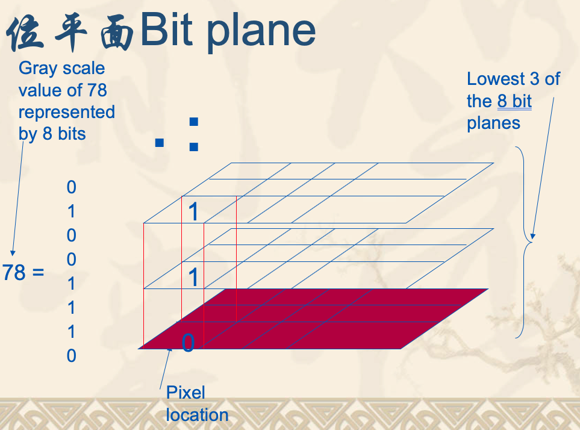

灰度化的图像为单通道格式存储像素，每个像素值在0～255内，而像素的位平面则是对应二进制的像素的各个位。以上图为例，某个像素的值为78，其二进制`01001110`，从左到右位权依次降低，最左边为最高有效位（MSB，其位权为 $2^7$ ），最右边位最低有效位（LSB，位权为$2^0$）。把每个像素的相同位抽取出来组成一个新的平面，就是所谓的图的位平面。而LSB隐写算法，如其名字，是在LSB也就是最低位平面进行信息嵌入/隐藏。

**需要注意的一点是，LSB嵌入的时候，载体图像格式应该为灰度图格式**

以著名的Lena图为例，一下是灰度图Lena原图：


下面是其各个位平面图，从左到右、从上到下位平面依次降低：

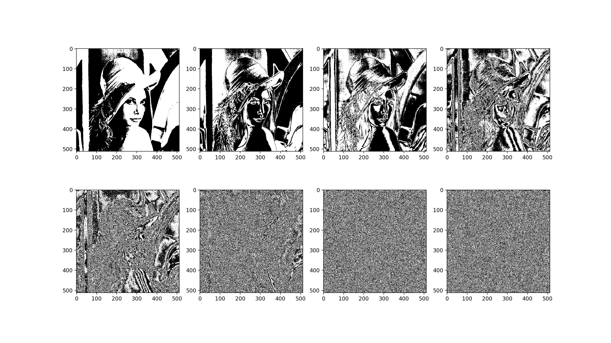

 可以看到，位平面越高包含的原图像信息越多，对图像的灰度值贡献越大，并且相邻比特的相关性也越强，反之则相反。LSB最低位平面基本上不包含图像信息了，类似随机的噪点/噪声，因此，可以在此处填入水印/秘密信息。

嵌入示意图如下：

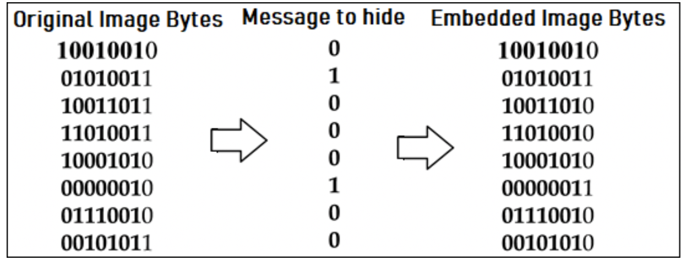

选取不同位平面嵌入时，LSB算法的保真度：


LSB算法的基本特点：

+ LSB是一种大容量的数据隐藏算法
+ LSB的鲁棒性相对较差（当stego图像遇到信号处理，比如：加噪声，有损压缩等，在提取嵌入信息时会丢失）

常见LSB算法的嵌入方法：

+ 秘密信息在最低位平面连续嵌入至结束，余下部分不作任何处理（典型软件MandelSteg）
+ 秘密信息在最低位平面连续嵌入至结束，余下部分随机化处理（也称沙化处理，典型软件PGMStealth）
+ 秘密信息在最低位平面和次低位平面连续嵌入，并且是同时嵌入最低位平面和次低位平面
+ 秘密信息在最低位平面嵌入，等最低位平面嵌入完全嵌入之后，再嵌入次低位平面
+ 秘密信息在最低位平面随机嵌入

以上五种方式，当嵌入容量不同时，鲁棒性不同

## 我改进的LSB算法（RG_LSB）

**与标准的LSB算法不同，我在设计我的LSB算法的时候，对嵌入的信息进行了随机嵌入，就是水印图像的比特流在嵌入载体图像时，并不是依次嵌入，而是随机选择位置嵌入。**

**此外，在嵌入时，对水印图像的比特流还进行了01规范化处理（使得嵌入的比特流0和1的个数一样多）。通过 规范化比特流 + 比特流随机嵌入 的方法，能够使得我的LSB算法具有抗击位平面图分析攻击，这里会在之后写一篇LSB隐写分析的文章中具体解释。**

**由于我增加了  规范化比特流 + 比特流随机嵌入，因此，为了能够提取水印，在嵌入过程中，我的算法会生成2个密钥文件：比特流规范密钥、嵌入位置密钥。所以，我的LSB算法不仅具有隐写术部分，还增加了密码术部分。**

**这部分可以结合我的代码来具体理解我的LSB算法流程**

## 前期准备（利用genNeedImg.py生成测试所用图像）

编写genNeedImg.py用于生成做本次实验所需的灰度图/二值图，详细介绍看里面的注释：

```python
def genNeedImg(imgPath,size=None,flag='binary'):
    '''
    用于生成指定大小的灰度图或二值图, imgPath为图像路径
    size为tuple类型，用于指定生成图像的尺寸, 如：(512,512)，默认为None表示输出原图像尺寸
    flag为标志转换类型，默认为binary，可选的值为binary或gray
    '''
    imgRow = cv.imread(imgPath)
    if size != None: # 调整图像尺寸
        imgRow= cv.resize(imgRow,size)
    imgGray = cv.cvtColor(imgRow,cv.COLOR_RGB2GRAY) # 转换颜色空间为灰度
    imgName = imgPath[9:].split('.')[0] # 获取图像原始名称
    if flag == 'gray': # 生成灰度图
        cv.imwrite('./images/{}_gray.bmp'.format(imgName),imgGray)
        print('Gray image generated!')
    else: # 生成二值图
        ret, imgBinary = cv.threshold(imgGray,127,255,cv.THRESH_BINARY)
        prop = int(size[0]*size[1]/(512*512)*100) # 以载体图像为512x512，算生成的水印大小占载体图的百分比
        cv.imwrite('./images/{}_binary{}.bmp'.format(imgName,prop),imgBinary) 
        print('Binary image generated!')
        print('threshold:{}'.format(ret)) # 输出转换阈值
```

测试genNeedImg.py，并生成所需要的灰度图作为载体图像，生成二值图作为嵌入的水印。在网上随意找了2张图片，左边的hn.png用于生成载体灰度图，右边的xn.jpg用于生成嵌入的二值水印图：

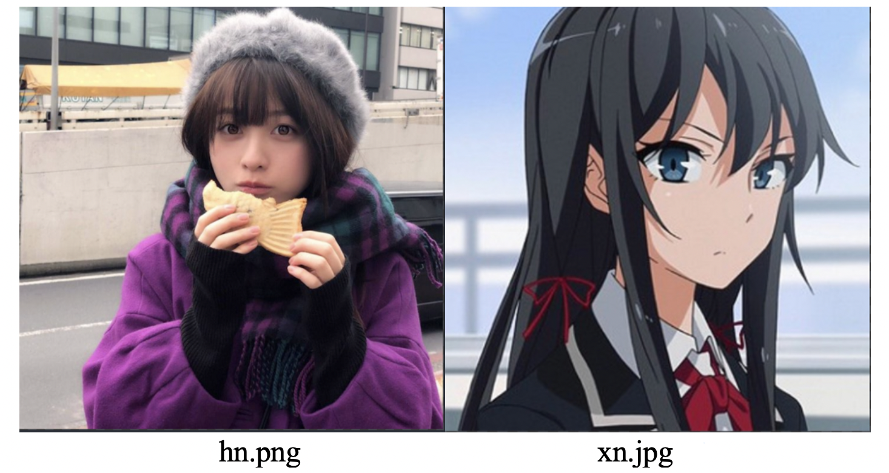

使用genNeedImg.py生成hn的灰度图用作载体图像，设置载体图像尺寸为512x512：

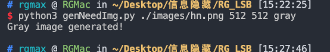

使用genNeedImg.py生成对上述载体图嵌入量分别为25%、50%和100%的二值图用作待嵌入水印:

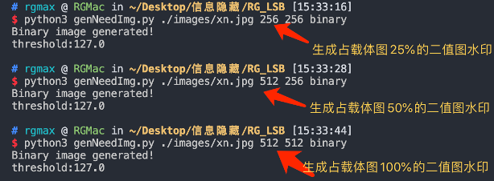

从左到右，第一张是用作载体的灰度图，接着依次是对载体图嵌入量分别为25%、50%和100%的二值图用作水印:

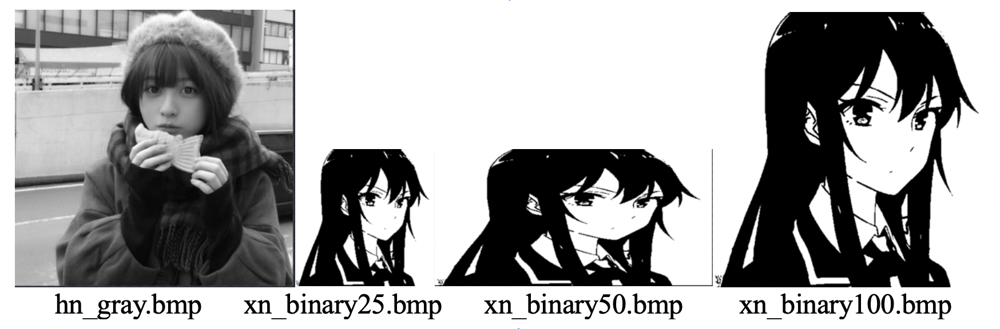

## 改进的LSB嵌入算法实现

**与标准的LSB算法不同，我在设计我的LSB算法的时候，对嵌入的信息进行了随机嵌入，就是水印图像的比特流在嵌入载体图像时，并不是依次嵌入，而是随机选择位置嵌入。此外，在嵌入时，对水印图像的比特流还进行了01规范化处理（使得嵌入的比特流0和1的个数一样多）。通过 规范化比特流 + 比特流随机嵌入 的方法，能够使得我的LSB算法具有抗击位平面图分析攻击，这里会在之后写一篇LSB隐写分析的文章中具体解释。由于我增加了  规范化比特流 + 比特流随机嵌入，因此，为了能够提取水印，在嵌入过程中，我的算法会生成2个密钥文件：比特流规范密钥、嵌入位置密钥。所以，我的LSB算法不仅具有隐写术部分，还增加了密码术部分**

编写LSB嵌入代码lsbEmbed.py：

```python
def genEmbedBinStream(imgEmbed):
    '''将嵌入图像抽取成比特流'''
    rowScale = imgEmbed.shape[0]
    columnScale = imgEmbed.shape[1]
    binStreamList = []
    for i in range(rowScale):
        for j in range(columnScale):
            if imgEmbed.item(i,j) != 0:
                imgEmbed.itemset((i,j),1)
            binStreamList.append(imgEmbed.item(i,j))
    return binStreamList

def streamNormalize(binStream): 
    '''
    规范化嵌入流，将嵌入流01比调整至1:1
    '''
    # binstarm长度为偶数最佳，若非偶数调整出的01比将与1:1有所偏差（但应该对lsb分析来看影响不大）
    # zeroPos、onePos分别存所有0、1在binStream中的位置序号
    zeroPos = [ pos for pos in range(len(binStream)) if binStream[pos] == 0]
    # zeeoPos = [pos for pos,value in enumerate(binStream) if value == 0]
    # 这种方式遍历更佳
    onePos = [ pos for pos in range(len(binStream)) if binStream[pos] == 1]
    zeroScale = len(zeroPos)
    oneScale = len(onePos)
    # flag 记录 0多还是1多
    flag = 1 if oneScale > zeroScale else 0
    appendScale = abs(oneScale - zeroScale)//2
    key = [flag,] # key保存的时候首先先存一个flag用于标识规范化之前0多还是1多
    if flag: # 1多，则把多出来的1置0
        key+= [i for i in random.sample(onePos,appendScale)]
        for pos in key[1:]: # key剔除首位的flag
            binStream[pos]=0
    else: # 0多，则把多出来的0置1
        key+= [i for i in random.sample(zeroPos,appendScale)]
        for pos in key[1:]:
            binStream[pos]=1
    with open('./keyfile/keyPos.json','w') as fp:
        json.dump(key,fp)
    return binStream

def binReplace(x:int,b:str,pos:int)->int:
    ''' int数值指定二进制位替换0 or 1，pos从右（二进制低位）从1开始计数 '''
    if b not in ['0','1']:
        print('b must be "0" or "1" !')
        return
    x = bin(x)[2:]
    if len(x) != 8: # 不足八位前面补0
        x= '0'*(8 - len(x)) + x 
    # xbinList = [ x[i] for i in range(len(x))]
    xbinList = list(x)
    # print(xbinList)
    xbinList[len(x) - pos] = b
    # print(xbinList)
    return int(''.join(xbinList),2)

def embeding(imgCover,binStreamList,embedZone,bitPlane=1):
    '''
    具体嵌入操作
    '''
    for coordinate, embedBin in zip(embedZone,binStreamList):
        tmp = imgCover.item(coordinate[0],coordinate[1])
        replace = binReplace(tmp,str(embedBin),bitPlane) 
        # 一定要注意embedBin是int的01但是传入的要是str的'0''1'
        # imgCover.itemset(coordinate,replace) # 指定位平面替换要嵌入的比特流
        # a = imgCover[coordinate[0]][coordinate[1]]
        imgCover[coordinate[0]][coordinate[1]]=replace
    return imgCover

# embedZone生成器（完全随机乱序）
def genRandEmbedZone(imgCoverPath,imgEmbedPath): # 做lsb分析时弃用
    '''生成随机的嵌入位置序列，整张imgcover随机选取位置序号'''
    imgCover = cv.imread(imgCoverPath,cv.IMREAD_GRAYSCALE) # 以灰度图方式读取载体图像
    imgEmbed = cv.imread(imgEmbedPath,cv.IMREAD_GRAYSCALE) #以灰度图方式读取嵌入图像
    binStreamScale = len(genEmbedBinStream(imgEmbed))
    rowScale = imgCover.shape[0]
    columnScale = imgCover.shape[1]
    zone = []
    for i in range(rowScale):
        for j in range(columnScale):
            zone.append(tuple([i,j]))
    return random.sample(zone,binStreamScale)

# embedZone生成器（指定区域随机乱序）
def genNormalZone(imgCoverPath,imgEmbedPath): # lsb分析的时候用这个，
    '''
    从imgcover的第0个像素依次取imgEmbed的比特流长度的位置作为嵌入位置
    但是，对其进行位置打乱嵌入，具体看代码
    '''
    imgCover = cv.imread(imgCoverPath,cv.IMREAD_GRAYSCALE) # 以灰度图方式读取载体图像
    imgEmbed = cv.imread(imgEmbedPath,cv.IMREAD_GRAYSCALE) #以灰度图方式读取嵌入图像
    binStreamScale = len(genEmbedBinStream(imgEmbed))
    rowScale = imgCover.shape[0]
    columnScale = imgCover.shape[1]
    zone = [] # zone是获得整个imgcover的所有像素坐标，可以不这么写，这么写效率比较低，但是懒得优化了
    for i in range(rowScale):
        for j in range(columnScale):
            zone.append(tuple([i,j]))
    return random.sample(zone[:binStreamScale],binStreamScale) # 返回打乱位置的位置序列列表
    # return zone[:binStreamScale] # 直接依次嵌入，不做随机处理

def LSBembedding(imgCoverPath:str,imgEmbedPath:str,embedZone:list,bitPlane=1): 
    '''
    LSB嵌入主函数，imgCoverPath为载体图像路径，imgEmbedPath为水印路径，
    embedZone为嵌入位置（由我写的算法自动生成），bitPlane用于指定嵌入的位平面，默认为1（LSB位）
    '''
    imgCover = cv.imread(imgCoverPath,cv.IMREAD_GRAYSCALE) # 以灰度图方式读取载体图像
    imgEmbed = cv.imread(imgEmbedPath,cv.IMREAD_GRAYSCALE) #以灰度图方式读取嵌入图像
    # 将嵌入水印抽取成比特流并做规范化，将比特流01比例调整为1:1，并做随机话处理，可以理解为对水印加密了
    binStreamList = streamNormalize(genEmbedBinStream(imgEmbed)) 
    # 判断嵌入信息是否过大
    if len(binStreamList) > imgCover.shape[0]*imgCover.shape[1]:
        print('嵌入的信息过大')
        return
    imgStego = embeding(imgCover,binStreamList,embedZone,bitPlane)
    imgCoverName = imgCoverPath[9:].split('.')[0]
    size = int(imgEmbed.shape[0]*imgEmbed.shape[1]/(512*512)*100)
    cv.imwrite('./img/{}_stego{}.bmp'.format(imgCoverName,size),imgStego)
    print('LSB Embeding done!')
    return imgStego
```

## LSB嵌入算法测试

测试lsbEmbed.py，并生成嵌入率为25%、50%和100%的stego图像：

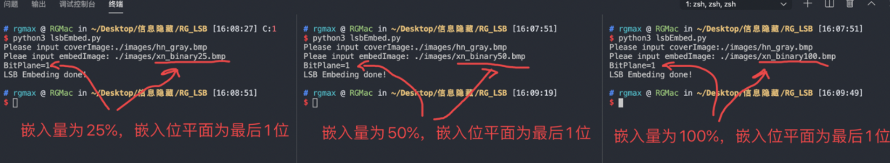

可以看到生成了对应的stego图像和密钥文件（用于提取时解密水印）：

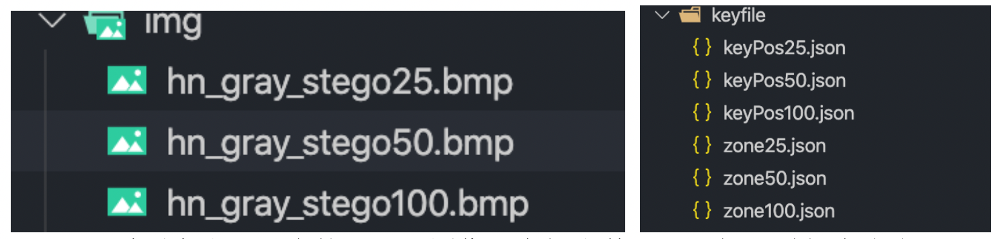

以下从左到右依次为，嵌入率25%、50%和100%的stego图像：

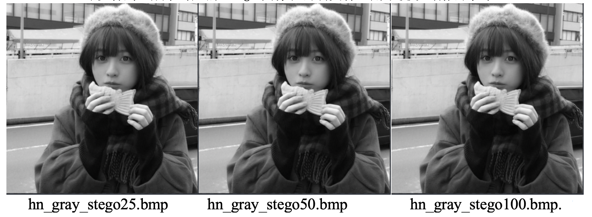

从肉眼看，基本看不出图像被嵌入了水印。

## LSB提取算法实现

编写LSB提取代码lsbExtract.py：

```python
def retRowStream(binStream,keyPos):
    '''
    将规范化的嵌入流还原成原始嵌入流（原始水印的01流）
    '''
    flag = keyPos[0]
    if flag:
        for pos in keyPos[1:]:
            binStream[pos]=1
    else:
        for pos in keyPos[1:]:
            binStream[pos]=0
    return binStream

def extractEmbedBinStream(imgStego,embedZone,bitPlane=1):
    '''
    从stego图片中提取嵌入的水印流信息，此处需要embedZone密钥（记录了嵌入位置）
    '''
    embedInt = [ imgStego.item(coordinate[0],coordinate[1]) for coordinate in embedZone] # 提取嵌入像素int值
    binStream = []
    for i in embedInt:
        iStr = bin(i)[2:]
        if len(iStr) != 8:
            iStr = '0'*(8-len(iStr)) + iStr
        b = iStr[len(iStr) - bitPlane]
        binStream.append(int(b))
    return binStream
    

def LSBextracting(imgStegoPath,embedZone,imgEmbedSize,keyPos,bitPlane=1):
    '''
    LSB提取主函数，embedZone密钥（记录了嵌入位置，imgEmbedSize为原始水印尺寸，
    keyPos是用于恢复原始水印比特流的密钥
    '''
    imgStego = cv.imread(imgStegoPath,cv.IMREAD_UNCHANGED)
    # 从stego提取嵌入的binstream（这里提取出来的stream是规范化的，01比为1:1）
    binStreamList = extractEmbedBinStream(imgStego,embedZone,bitPlane=1)
    # 将规范化的stream逆回成原始binstream，此时得到的才是真正嵌入的信息流
    binStreamList = retRowStream(binStreamList,keyPos)
    embedList = [] # 将01流恢复成二值图像素列表
    for b in binStreamList:
        if b == 1:
            embedList.append(255)
        else:
            embedList.append(0)
    # 利用像素列表恢复成图像矩阵
    imgEmbedMatrix = [ embedList[i*imgEmbedSize[0]:(i+1)*imgEmbedSize[0]] for i in range(imgEmbedSize[1])]
    # print(imgEmbedMatrix)
    imgEmbed = np.array(imgEmbedMatrix,dtype=np.uint8)
    cv.imwrite('./img/img_extract.bmp',imgEmbed)
    print('LSB extracting done!')
```

## LSB提取算法测试

测试lsbExtract.py，并测试对嵌入率为25%、50%和100%的stego图像的水印提取：

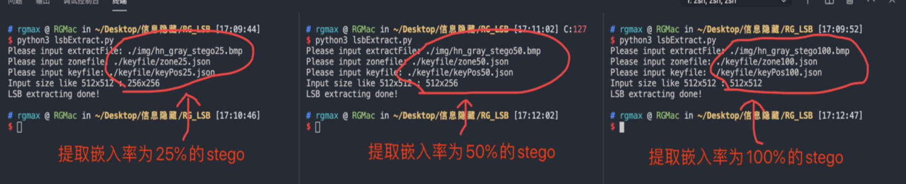

以下是执行结果，从左到右依次为，从嵌入率25%、50%和100%的stego图像提取出的水印：

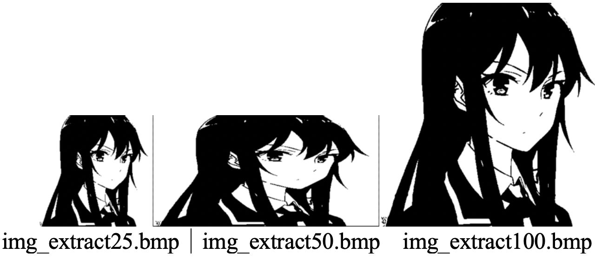

## 对我设计的LSB进行性能分析

### 不可感性分析（PSNR）

先介绍一些何为PSNR：PSNR（Peak Signal to Noise Ratio），即峰值信噪比，是一种评价图像的客观标准。

为了衡量经过处理后的影像品质，学术上通常会用PSNR值来衡量某个处理程序能否令人满意。它是原图像与被处理图像之间的[均方误差](https://baike.baidu.com/item/均方误差)相对于 $(2^{b-1})^2$ 的对数值(信号最大值的平方，b是每个采样值的比特数)，它的单位是dB。PSNR值越大，就代表失真越少。而 $ (2^{b-1})^2 $也被称作图片可能的最大像素值，如果每个像素都由 8 位二进制来表示（LSB算法中用灰度图就是 8bits per pixel），那么 $ (2^{b-1})$ 就为 255。

其数学计算公式如下：
$$
P S N R=10 \times \log _{10}\left(\frac{\left(2^{b}-1\right)^{2}}{M S E}\right)
$$
其中，MSE(Mean Square Error)是原图像（语音）与处理图像（语音）之间均方误差。给定一个大小为 m×n 的干净图像 $I$和噪声图像 $K$ ，均方误差(MSE) 定义为：
$$
M S E=\frac{1}{m n} \sum_{i=0}^{m-1} \sum_{j=0}^{n-1}[I(i, j)-K(i, j)]^{2}
$$
**划重点：PSNR值越大，就代表失真越少，两个图像（$I$ 和 $K$）越相似。**

#### PSNR代码实现以及测试

编写psnr.py用于计算psnr：

```python
def psnr(img_1, img_2):
    mse = np.mean((img_1 / 1.0 - img_2 / 1.0) ** 2)
    if mse < 1.0e-10:
        return 100
    return 10 * math.log10(255.0 ** 2 / mse)
```

对于不同嵌入率情况下对嵌入后图像，进行不可感性分析（计算PSNR）:

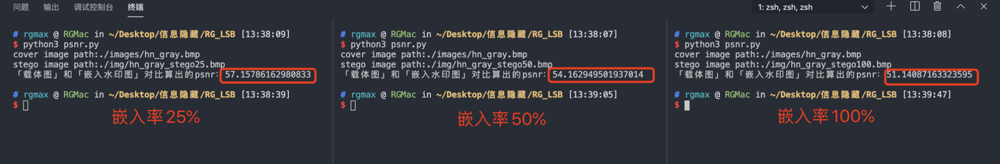

从左到右分别是嵌入率25%、50%和100%的psnr值，依次为57.1579、54.1629、51.1409，均在50以上。同时也可以看到，随着嵌入率提升，PSNR值会随之下降。

- PSNR高于40dB说明图像质量极好（即非常接近原始图像），
- 在30—40dB通常表示图像质量是好的（即失真可以察觉但可以接受），
- 在20—30dB说明图像质量差；而PSNR低于20dB图像不可接受

因此，我写的LSB嵌入算法嵌入效果极其出色，嵌入后的stego图像的不可感知性极为出色。

### 错误率分析

我设计的错误率计算公式：
$$
falseRate=\frac{\sum_{i=0}^{n} \frac{\left|p_{i}-p^{\prime}_{i}\right|}{256}}{n}=\frac{256}{n} \cdot \sum_{i=0}^{n}\left|p_{i}-p_{i}^{\prime}\right|
$$
其中n为图片总像素个数，$p_i$ 是原始水印第i个像素的像素值，$p^{\prime}_i$ 为提取出来的水印的第i个像素的像素值。

#### 错误率代码实现以及测试

依据该公式，编写falseRate.py用于计算错误率:

```python
def falseRate(img1,img2):
    img1_float = np.array(img1,dtype=np.float)
    img2_float = np.array(img2,dtype=np.float)
    return np.mean(abs(img1_float-img2_float))/256
```

对于不同嵌入率情况下对嵌入后图像，进行错误率计算：

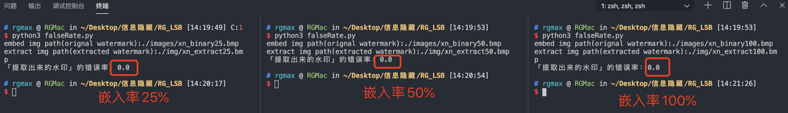

从左到右分别是嵌入率25%、50%和100%计算出来的falseRate值，可以看到均为0，无错误。

### 鲁棒性分析

#### 对图像做加噪攻击

编写noise.py用于给图像进行椒盐加噪：

```python
def sp_noise(image,prob):
    '''
    添加椒盐噪声
    prob:噪声比例 
    '''
    output = np.zeros(image.shape,np.uint8)
    thres = 1 - prob 
    for i in range(image.shape[0]):
        for j in range(image.shape[1]):
            rdn = random.random()
            if rdn < prob:
                output[i][j] = 0
            elif rdn > thres:
                output[i][j] = 255
            else:
                output[i][j] = image[i][j]
    return output
```

对之前生成的stego进行加噪:

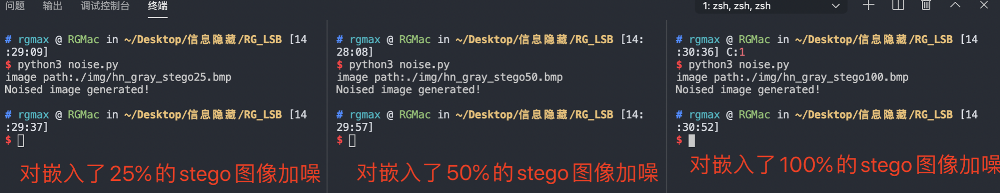

从左到右分别是对嵌入率25%、50%和100%的stego进行椒盐加噪生成的图片:

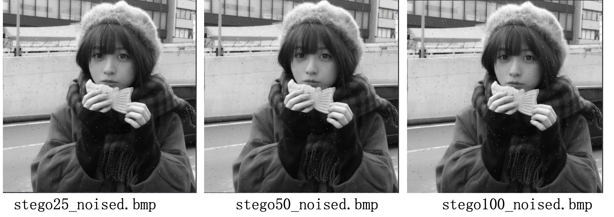

#### 对加噪后stego提取水印并计算错误率

使用falseRate.py计算错误率：

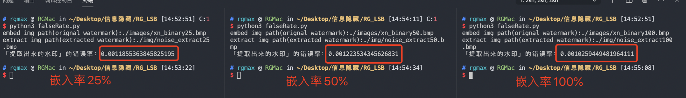

从左到右依次是0.1186%、0.1224%和0.1026%

**注：由于错误率公式是我自己定义的，这里的百分比不是直观的效果，我测出来，当错误率达到5‰时，提取出来的水印就基本失真了)**

**因此，为了使错误率结果值更为直观，用千分号（‰）来看**

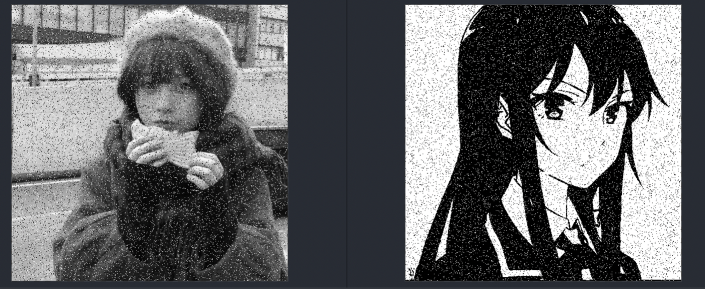

**这是椒盐加噪系数为0.55，左边为stego，右边为提取出来的水印，此时水印错误里达到55.29‰**

**因此，定义错误率5‰为提取出的水印好坏阈值。**可以看到受到椒盐加噪攻击之后，提取的水印出现了部分错误。但是，受到攻击后提取出的水印错误率并不是很高，说明我的LSB算法具有一定的鲁棒性，不过可能和椒盐系数有关，下面针对100%嵌入分析一下。

#### 椒盐系数对水印提取效果的影响

通过多次测试，在嵌入率100%时，不同椒盐系数prob下提取出来的水印false rate如下表所示：

| prob  | false rate | false rate /（‰） |
| ----- | ---------- | ----------------- |
| 0.001 | 0.00100695 | 1.006945968       |
| 0.005 | 0.00484474 | 4.844740033       |
| 0.01  | 0.00983767 | 9.837672114       |
| 0.015 | 0.01451142 | 14.51142132       |
| 0.02  | 0.01971334 | 19.71334219       |
| 0.025 | 0.02429970 | 24.29969609       |
| 0.03  | 0.02919003 | 29.19003367       |
| 0.035 | 0.03429696 | 34.29695964       |
| 0.04  | 0.03969267 | 39.69267011       |
| 0.045 | 0.04462861 | 44.62860525       |
| 0.05  | 0.04930995 | 49.30995405       |
| 0.55  | 0.05329214 | 53.29214036       |

由上表绘制的prob和false rate关系曲线图：

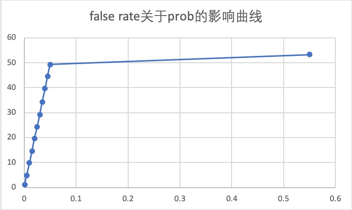

## 总结

通过本项目，我巩固复习了LSB隐写算法的整体流程，同时使用python而不是matlab实现了自己的LSB算法。通过对自己选取的图片，进行二值水印嵌入和提取，测试了我设计的LSB算法的性能：

- 拥有极好的不可感知性，肉眼观察嵌入图与原图毫无差别，在嵌入率25%、50%和100%的psnr值，依次为57.1579、54.1629、51.1409，均在50以上
- 在没有攻击情况下，在嵌入率25%、50%和100%的情况下，提取水印的错误率均为0%，说明提取效果极佳
- 在椒盐加噪系数0.01（常用），嵌入率25%、50%和100%的情况下，提取水印的错误率均为依次为1.186‰、1.224‰和1.026‰，说明有一定的鲁棒性

（注：由于错误率公式是我自己定义的，这里的百分比不是直观的效果，我测出来，当错误率达到5%时，提取出来的水印就基本失真了，为了使错误率结果值更为直观，用千分号（‰）来看）

本项目，我的原创之处：

- 使用python而不是matlab实现，所有算法所有函数均为我亲自独立完成

- 自定义了错误率计算公式，并测试得出在该公式下的水印质量评价标准阈值（定义错误率5‰为提取出的水印好坏阈值），公式如下：
  $$
  falseRate=\frac{\sum_{i=0}^{n} \frac{\left|p_{i}-p^{\prime}_{i}\right|}{256}}{n}=\frac{256}{n} \cdot \sum_{i=0}^{n}\left|p_{i}-p_{i}^{\prime}\right|
  $$
  其中n为图片总像素个数，$p_i$ 是原始水印第i个像素的像素值，$p^{\prime}_i$ 为提取出来的水印的第i个像素的像素值。

 此外，我在原本LSB算法的基础上增加的改进：

- 对于LSB嵌入的时候，我对水印做了处理（可以理解为加密），效果是使得嵌入的01均匀且随机分布
- 我在嵌入的时候做了随机位置乱序嵌入，使得用位平面分析我的LSB根本分析不出来，藏得效果极好